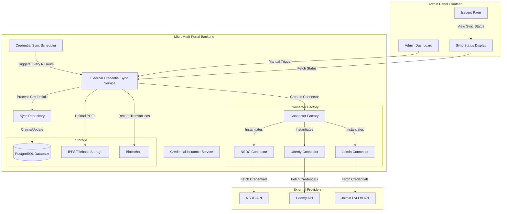
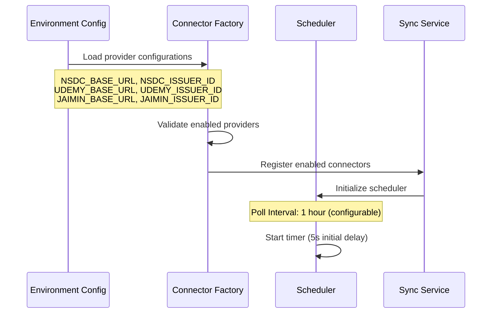
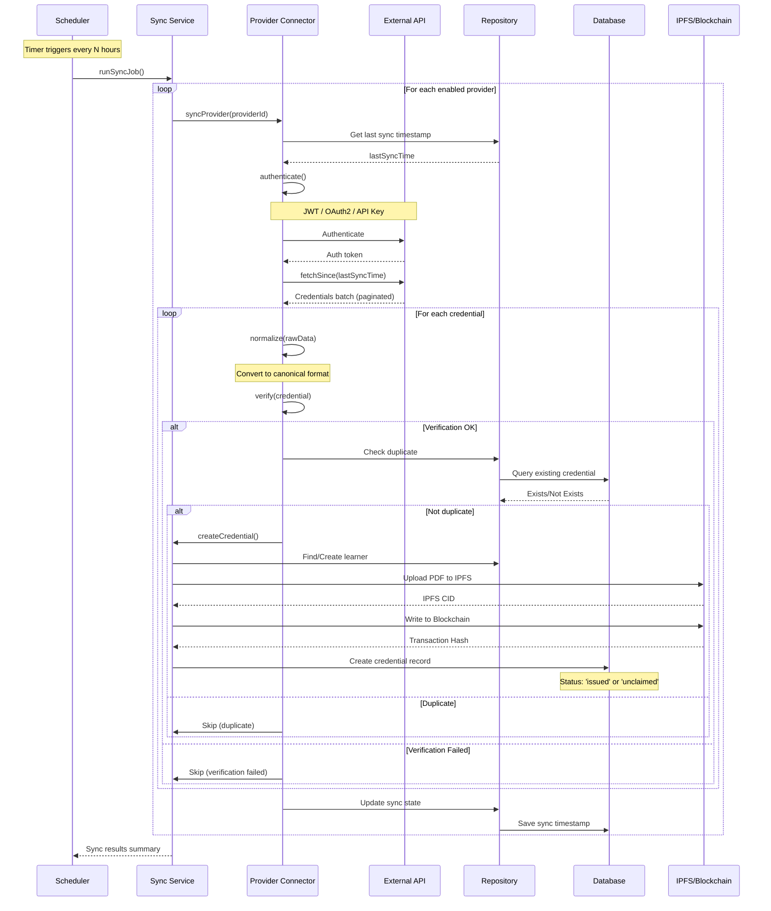
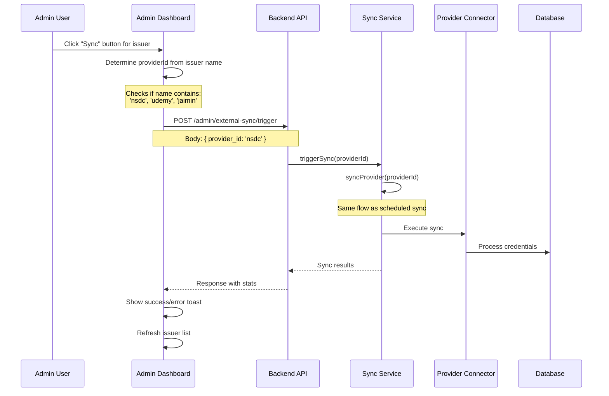
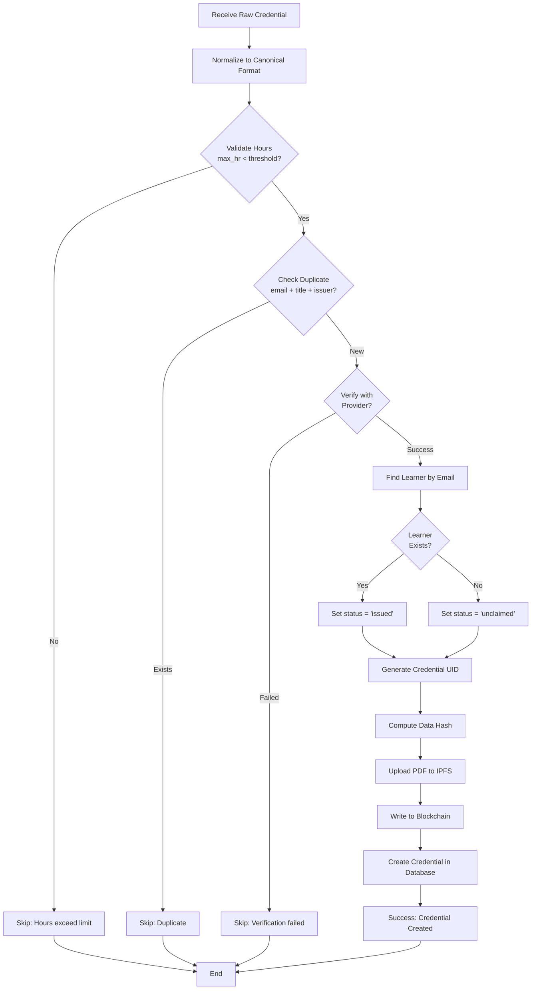

# Auto Fetch Issuers Flow Diagram

## Overview
This document describes the automated credential synchronization flow from external issuer platforms (NSDC, Udemy, Jaimin Pvt Ltd, etc.) into the MicroMerit Portal system.

---

## System Architecture



---

## Detailed Flow Sequence

### 1. Initialization Phase



### 2. Automatic Sync Flow (Scheduled)



### 3. Manual Sync Flow (Admin Triggered)



### 4. Credential Processing Flow



---

## Component Details

### Connector Factory

**File**: `server/node-app/src/modules/external-credential-sync/connector.factory.ts`

**Responsibilities**:
- Load provider configurations from environment variables
- Instantiate appropriate connector based on provider ID
- Manage enabled/disabled providers

**Provider Configuration Structure**:
```typescript
interface ProviderConfig {
    id: string;              // 'nsdc', 'udemy', 'jaimin'
    name: string;            // Display name
    issuer_id: number;       // MicroMerit issuer ID
    base_url: string;        // API endpoint
    auth_type: string;       // 'jwt', 'oauth2', 'api_key'
    credentials: object;     // Auth credentials
    enabled: boolean;        // Enable/disable sync
}
```

### Individual Connectors

Each connector implements the `Connector` interface:

```typescript
interface Connector {
    providerId: string;
    issuerId: number;
    
    authenticate(): Promise<void>;
    fetchSince(sinceISO: string, pageToken?: string): Promise<FetchResult>;
    normalize(rawData: any): CanonicalCredential;
    verify(rawData: any): Promise<VerificationResult>;
}
```

**Connector Implementations**:
1. **NSDC Connector**: JWT authentication
2. **Udemy Connector**: OAuth2 authentication
3. **Jaimin Connector**: API Key authentication

### Sync Scheduler

**File**: `server/node-app/src/modules/external-credential-sync/scheduler.ts`

**Features**:
- Configurable poll interval (default: 1 hour)
- Initial sync after 5 seconds
- Prevents concurrent sync jobs
- Tracks last sync timestamp
- Can be started/stopped via admin API

### Canonical Credential Format

All external credentials are normalized to this format:

```typescript
interface CanonicalCredential {
    external_id: string;
    learner_email: string;
    certificate_title: string;
    issued_at: Date;
    completion_date?: Date;
    max_hr?: number;
    pdf_url?: string;
    metadata: {
        provider_id: string;
        original_data: any;
        nsqf_level?: number;
        skills?: string[];
        // ... provider-specific fields
    };
}
```

---

## Admin Dashboard Integration

### Issuer Page Features

**File**: `client/admin/src/pages/Issuers.tsx`

**View Modes**:
1. **Connector View**: Shows issuers synced from external providers
2. **Platform View**: Shows issuers registered directly on platform

**Sync Features**:
- View sync status for each provider
- Manual sync trigger button
- Real-time sync progress indicators
- Sync history and statistics

### Sync Status Display

**State Structure**:
```typescript
interface SyncState {
    provider_id: string;
    status: 'idle' | 'running' | 'completed' | 'failed';
    last_sync_at: Date;
    last_successful_sync_at?: Date;
    credentials_synced: number;
    errors: string[];
}
```

**Visual Indicators**:
- 🟢 Green: Last sync successful
- 🟡 Yellow: Sync in progress
- 🔴 Red: Last sync failed
- ⚪ Gray: Never synced

---

## API Endpoints

### Admin Endpoints

```
GET    /admin/external-sync/status
POST   /admin/external-sync/trigger
POST   /admin/external-sync/scheduler/start
POST   /admin/external-sync/scheduler/stop
GET    /admin/external-sync/providers
```

### Trigger Sync Request
```json
POST /admin/external-sync/trigger
{
    "provider_id": "nsdc"  // Optional: omit to sync all providers
}
```

### Status Response
```json
{
    "success": true,
    "data": {
        "scheduler": {
            "running": true,
            "interval_hours": 1,
            "last_sync_at": "2025-12-09T10:30:00Z"
        },
        "providers": [
            {
                "id": "nsdc",
                "name": "NSDC",
                "enabled": true,
                "has_issuer": true,
                "sync_state": {
                    "status": "completed",
                    "credentials_synced": 45,
                    "last_sync_at": "2025-12-09T10:30:00Z"
                }
            }
        ]
    }
}
```

---

## Environment Configuration

Required environment variables for each provider:

### NSDC Provider
```bash
NSDC_ENABLED=true
NSDC_BASE_URL=http://localhost:4000
NSDC_ISSUER_ID=1
NSDC_CLIENT_ID=your-client-id
NSDC_CLIENT_SECRET=your-secret
```

### Udemy Provider
```bash
UDEMY_ENABLED=true
UDEMY_BASE_URL=http://localhost:4000
UDEMY_ISSUER_ID=2
UDEMY_CLIENT_ID=your-client-id
UDEMY_CLIENT_SECRET=your-secret
```

### Jaimin Provider
```bash
JAIMIN_ENABLED=true
JAIMIN_BASE_URL=http://localhost:4000
JAIMIN_ISSUER_ID=3
JAIMIN_API_KEY=your-api-key
```

### General Settings
```bash
POLL_INTERVAL_HOURS=1        # Sync frequency
POSSIBLE_MAX_HOUR=1000       # Skip credentials exceeding hours
```

---

## Data Flow Summary

```
┌─────────────────────────────────────────────────────────────────┐
│                    AUTO FETCH ISSUERS FLOW                       │
└─────────────────────────────────────────────────────────────────┘

1. INITIALIZATION
   └─> Load provider configs from env
   └─> Create connectors for enabled providers
   └─> Start scheduler with configured interval

2. SCHEDULED SYNC (Every N hours)
   └─> Scheduler triggers sync job
   └─> For each enabled provider:
       ├─> Authenticate with provider API
       ├─> Fetch credentials since last sync
       ├─> Normalize to canonical format
       ├─> Verify and validate credentials
       ├─> Check for duplicates
       ├─> Upload PDFs to IPFS
       ├─> Record on blockchain
       └─> Create credential in database

3. MANUAL SYNC (Admin triggered)
   └─> Admin clicks sync button
   └─> UI sends trigger request
   └─> Same process as scheduled sync
   └─> Return results to UI

4. CREDENTIAL STATES
   └─> 'issued': Learner exists in system
   └─> 'unclaimed': Learner not registered yet
   └─> Auto-claimed when learner signs up

5. MONITORING
   └─> View sync status in admin panel
   └─> Track credentials synced per provider
   └─> View sync errors and failures
   └─> Control scheduler (start/stop)
```

---

## Error Handling

### Skip Scenarios
- Hours exceed threshold (`max_hr > POSSIBLE_MAX_HOUR`)
- Duplicate credential detected
- Provider verification failed
- Issuer not found in database

### Failure Recovery
- Sync state saved as 'failed' with error messages
- Next scheduled sync will retry
- Manual retry available via admin panel
- Errors logged with detailed context

### Sync State Persistence
- Last sync timestamp stored per provider
- Incremental sync (only new/updated credentials)
- Prevents duplicate processing
- Sync statistics tracked and displayed

---

## Best Practices

1. **Provider Configuration**
   - Always validate issuer IDs exist before enabling
   - Test authentication credentials before deployment
   - Monitor API rate limits

2. **Sync Interval**
   - Balance freshness vs. API load
   - Consider provider API limitations
   - Adjust based on credential volume

3. **Monitoring**
   - Regularly check sync status in admin panel
   - Investigate failed syncs promptly
   - Monitor database growth

4. **Security**
   - Store provider credentials securely in environment
   - Use HTTPS for provider API calls
   - Validate all incoming credential data

---

## Future Enhancements

- [ ] Webhook support for real-time sync
- [ ] Retry mechanism for failed credentials
- [ ] Bulk sync with progress tracking
- [ ] Provider-specific sync schedules
- [ ] Advanced filtering and search
- [ ] Sync analytics and reporting
- [ ] Multi-tenant provider support
- [ ] Custom connector plugin system
