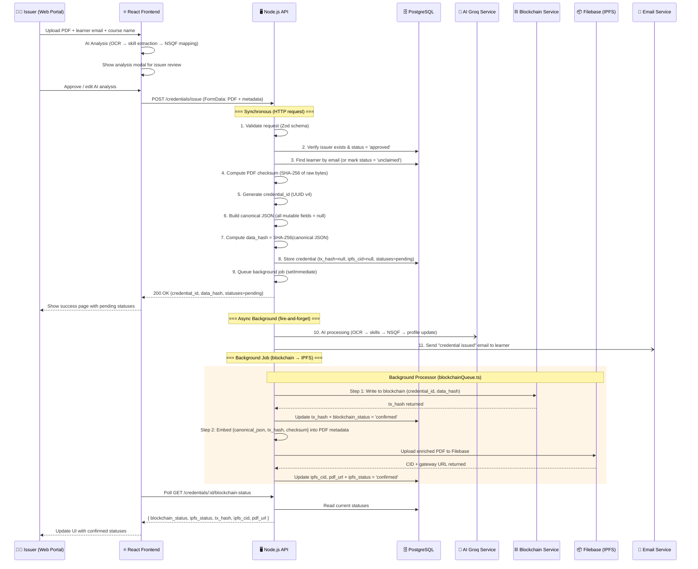
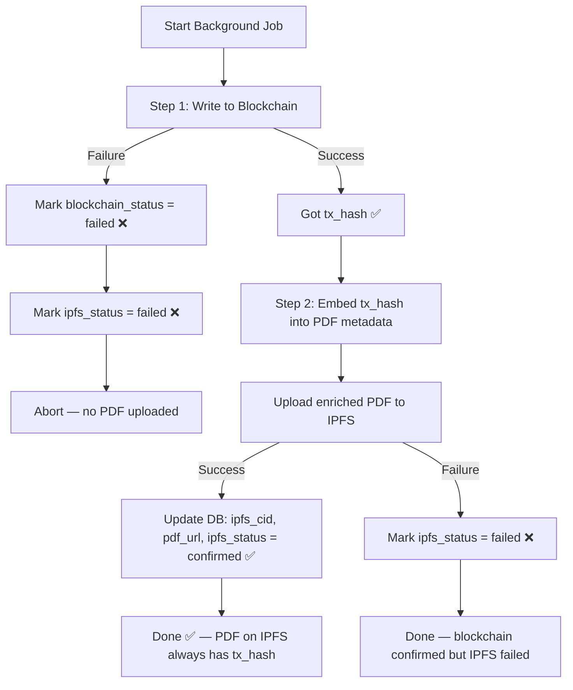
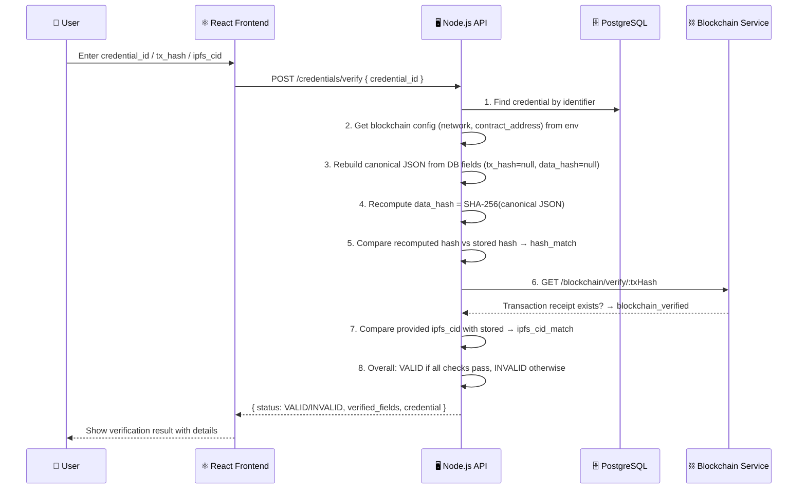
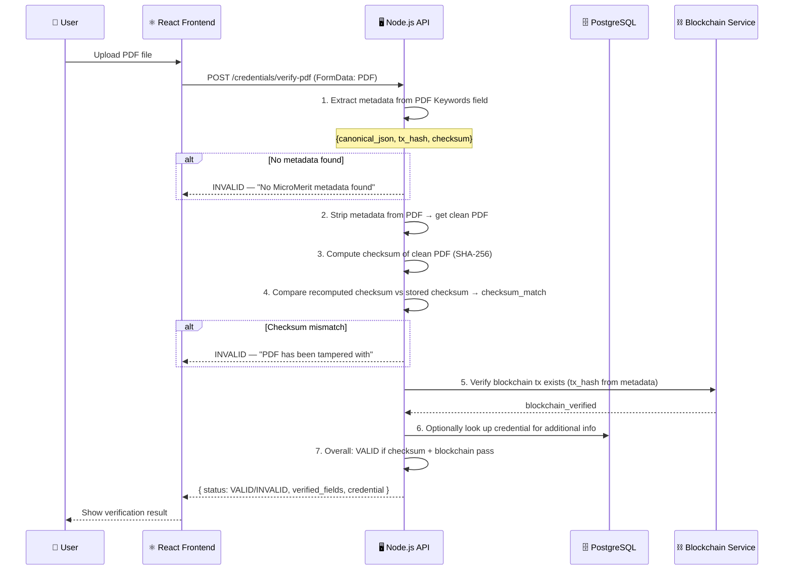
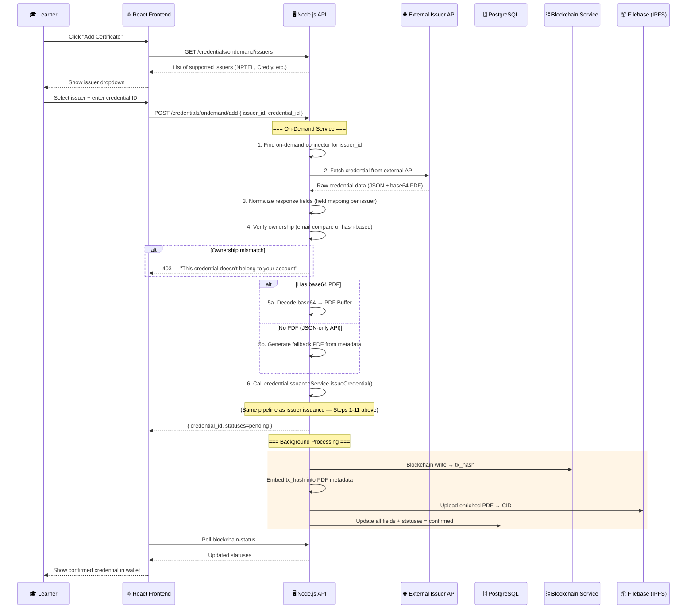
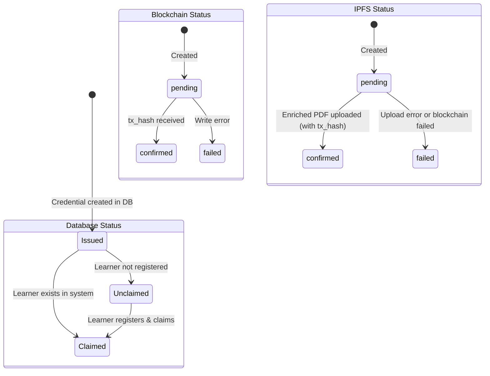
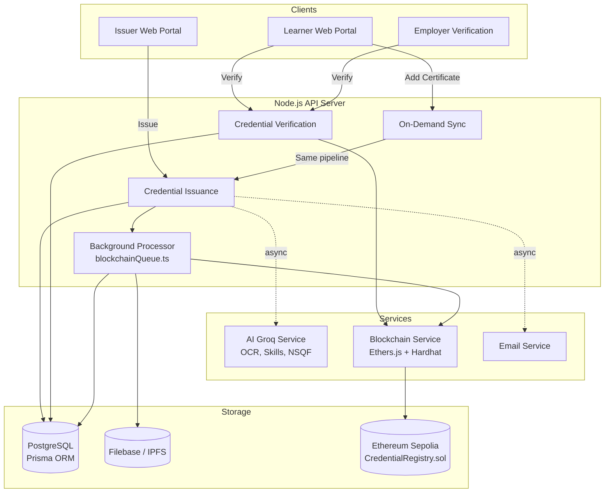

# Credential Lifecycle — Issuance, Verification & Add Certificate

This document covers the full step-by-step flows for credential issuance, verification, and the "Add Certificate" lifecycle, with Mermaid diagrams.

---

## 1. Credential Issuance Flow (Issuer Portal)

When an issuer uploads a PDF certificate from the web portal.



### Canonical JSON Structure (used for hashing)

```json
{
  "credential_id": "uuid",
  "learner_id": "123",
  "learner_email": "user@example.com",
  "issuer_id": "1",
  "certificate_title": "AWS Cloud Developer",
  "issued_at": "2025-01-15T10:30:00.000Z",
  "ipfs_cid": null,
  "pdf_url": null,
  "blockchain": {
    "network": "sepolia",
    "contract_address": "0x...",
    "tx_hash": null
  },
  "meta_hash_alg": "sha256",
  "data_hash": null
}
```

> **Note:** `ipfs_cid`, `pdf_url`, `tx_hash`, and `data_hash` are **null** during hash computation, making `data_hash` deterministic at issuance time — before blockchain or IPFS results exist.

### PDF Metadata (embedded in Keywords field)

```json
{
  "canonical_json": { "...the full canonical JSON above..." },
  "tx_hash": "0xabc123...",
  "checksum": "sha256-of-original-pdf-bytes"
}
```

> **tx_hash** is always present because the PDF is only uploaded to IPFS **after** blockchain confirmation.
> **ipfs_cid** is NOT stored in the PDF metadata (it would create a circular dependency).

---

## 2. Why Blockchain Runs Before IPFS

### The Problem

If IPFS runs first, the raw PDF gets uploaded without `tx_hash` in its metadata. Users who download the PDF before the re-upload would get a PDF missing blockchain proof.

### The Solution



### What about the CID in blockchain logs?

The smart contract stores `(credential_id, data_hash, ipfs_cid)`. Since blockchain runs **before** IPFS upload, the real CID doesn't exist yet. A **placeholder value** (`"pending-upload"`) is passed to the blockchain.

This is acceptable because:
- **Verification by identifier** looks up the credential in the DB (which has the real CID) and verifies the blockchain tx exists — it doesn't compare on-chain CID with DB CID.
- **Verification by PDF** extracts `tx_hash` from PDF metadata and verifies the tx exists on-chain.
- The `data_hash` on-chain is verified against the recomputed hash from the DB — CID is null in both cases.

---

## 3. Credential Verification Flow

Two modes: **by identifier** and **by PDF upload**.

### 3a. Verify by Identifier



### 3b. Verify by PDF Upload



---

## 4. "Add Certificate" Lifecycle (Learner-Initiated)

When a learner adds a certificate from an external issuer (e.g., NPTEL, Credly).



### Detailed Step-by-Step

| Step | What Happens | Where |
|------|-------------|-------|
| 1 | Learner selects issuer & enters external credential ID | Frontend |
| 2 | Find matching on-demand connector (NPTEL, Credly, etc.) | `ondemand.connectors.ts` |
| 3 | Fetch raw data from external issuer's API/endpoint | `ondemand.connectors.ts` |
| 4 | Normalize fields (title, email, dates, PDF) via connector | `connector.normalize()` |
| 5 | Verify ownership — email match or hash-based verification | `connector.verify()` |
| 6 | Get PDF: decode base64 or generate fallback PDF | `ondemand.service.ts` |
| 7 | Call `issueCredential()` — full pipeline | `credential-issuance/service.ts` |
| 8 | Compute checksum, data_hash, store in DB | `credential-issuance/service.ts` |
| 9 | Background: blockchain write → get tx_hash | `blockchainQueue.ts` |
| 10 | Background: embed tx_hash in PDF → upload to IPFS | `blockchainQueue.ts` |
| 11 | Update DB: ipfs_cid, pdf_url, statuses = confirmed | `blockchainQueue.ts` |
| 12 | AI processing (async): OCR → skills → NSQF | `ai_groq_service` |
| 13 | Send email notification to learner | `email.ts` |

---

## 5. Complete Credential State Machine



---

## 6. Architecture Overview



---

## 7. Key File References

| Component | File |
|-----------|------|
| Issuance Service | `server/node-app/src/modules/credential-issuance/service.ts` |
| Issuance Controller | `server/node-app/src/modules/credential-issuance/controller.ts` |
| Background Processor | `server/node-app/src/services/blockchainQueue.ts` |
| Verification Service | `server/node-app/src/modules/credential-verification/service.ts` |
| On-Demand Service | `server/node-app/src/modules/external-credential-sync/ondemand.service.ts` |
| On-Demand Connectors | `server/node-app/src/modules/external-credential-sync/ondemand.connectors.ts` |
| PDF Metadata Utils | `server/node-app/src/utils/pdfMetadata.ts` |
| Canonical JSON Utils | `server/node-app/src/utils/canonicalJson.ts` |
| Filebase Upload | `server/node-app/src/utils/filebase.ts` |
| Blockchain Utils | `server/blockchain/src/utils/blockchain.ts` |
| Smart Contract | `server/blockchain/contracts/CredentialRegistry.sol` |
| Issuer Frontend | `client/main-app/src/pages/issuer/NewIssuance.jsx` |
| Learner Success Page | `client/main-app/src/pages/learner/CredentialAdded.jsx` |
